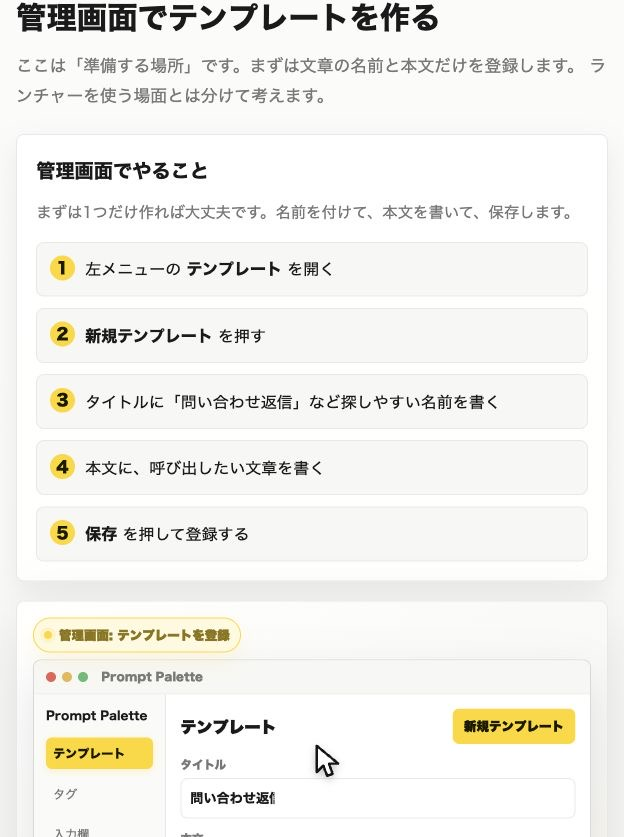

# Prompt Palette かんたんマニュアル

Prompt Palette は、よく使う文章を登録して、必要なときにすぐ呼び出して貼り付けるアプリです。

たとえば「問い合わせ返信」「AIへの指示文」「日報のひな形」「定型あいさつ」などを登録しておくと、毎回ゼロから書かなくてよくなります。

視覚的に見たい場合は、[3D版マニュアル](user-manual.html) を開いてください。



## まず覚えること

| やること | 画面で見る場所 | 何が起きるか |
| --- | --- | --- |
| 文章を登録する | テンプレート | よく使う文章を保存できます |
| 文章を呼び出す | `Ctrl + Space` | 小さな検索画面が出ます |
| 毎回変わる部分を作る | 入力欄を追加 | 名前や日付などを毎回入力できます |
| 他のPCへ移す | インポート/エクスポート | テンプレートをファイルで移せます |
| 見た目やキーを変える | 設定 | テーマ、文字サイズ、ショートカットを変えられます |

## 管理画面でテンプレートを作る

管理画面は「準備する場所」です。ここでは、呼び出したい文章を登録します。

1. 左メニューの **テンプレート** を開きます。
2. **新規テンプレート** を押します。
3. **タイトル** に、あとで探しやすい名前を書きます。
   - 例: `問い合わせ返信`
4. **本文** に、呼び出したい文章を書きます。
5. **保存** を押します。

## ランチャーで呼び出して貼る

ランチャーは「実際に使う場所」です。管理画面とは別で、メモやメールなど文章を入れたい場所を開いてから使います。

1. テキストメモなど、貼り付けたい場所を開きます。
2. `Ctrl + Space` を押してランチャーを出します。
3. 検索欄に、テンプレート名や本文の一部を入れます。
   - 例: `問い合わせ`
4. 使いたいテンプレートを選んで Enter を押します。
5. 今の入力場所へ文章が貼り付けられます。

覚えておくと便利です。

- 上下キーで候補を選べます。
- 入力欄があるテンプレートは、必要な項目だけ入力してから貼り付けます。
- 貼り付けに失敗しても、文章はクリップボードにコピーされます。その場合は手動で `Ctrl + V` を押してください。

## 入力欄とは

入力欄は、テンプレートの中で毎回変わる部分に使います。

- 毎回変わる部分: お客様名、商品名、日付、担当者名、URL
- 選択式にしたい部分: 返信トーン、優先度、カテゴリ、決まった言い回し
- 本文に残す部分: 毎回同じあいさつ、説明、締めの文章

たとえば本文をこう作っておくと、

```text
{{お客様名}} 様

お問い合わせありがとうございます。
```

呼び出したときに **お客様名** だけ入力して、完成した文章を貼り付けられます。

ただし、普段は `{{...}}` を手で覚える必要はありません。テンプレート編集画面の **入力欄を追加** から作れば大丈夫です。

## 画面ごとの役割

| 画面 | 使うタイミング |
| --- | --- |
| テンプレート | 文章を作る、直す、カテゴリやタグで整理する |
| タグ | テンプレートを探しやすくするラベルを管理する |
| 入力欄 | テンプレートで使う入力欄をまとめて見る |
| インポート/エクスポート | バックアップ、共有、別PCへの引っ越し |
| 設定 | 言語、見た目、文字サイズ、ショートカットの変更 |

## よくある困りごと

| 困ったこと | まず試すこと |
| --- | --- |
| `Ctrl + Space` で出ない | アプリが起動しているか確認し、設定でショートカットを変えてみる |
| 検索しても出ない | カテゴリを「すべて」に戻し、別の言葉で検索する |
| 入力欄が出ない | テンプレート本文に入力欄が入っているか確認する |
| 自動で貼り付かない | 文章はコピー済みなので、手動で `Ctrl + V` を押す |
| 別PCへ移したい | エクスポートでファイルを作り、移行先でインポートする |

## おすすめの使い方

- AIへのよく使う依頼文を登録する
- メール返信の型を登録する
- 日報や振り返りの型を登録する
- SNS投稿の下書きパターンを登録する
- サポート返信の文章をチームでそろえる
